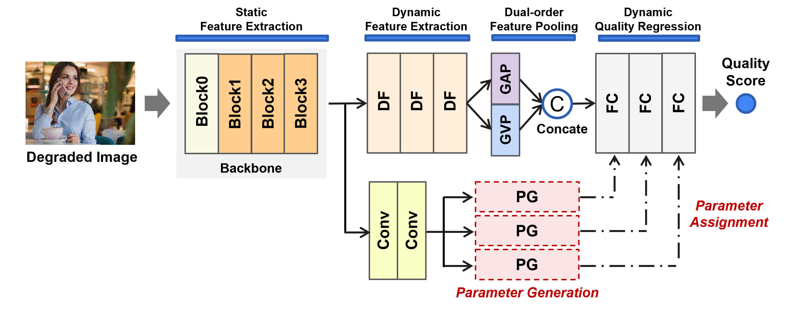

## Introduction

This repository is the [PyTorch](http://pytorch.org)  official implementation of "[Deep Blind Image Quality Assessment Using Dynamic Neural Model with Dual-order Statistics](#)" in xxxx.

<p align = 'center'>

</p>
<p align = 'center'>
Fig. Architecture of the proposed net
</p>

## Docker support

This repository has a docker container support, using a official docker engine instalation from https://docs.docker.com/engine/install/ubuntu/ and using a official NVIDIA container toolkit instalation from https://docs.nvidia.com/datacenter/cloud-native/container-toolkit/latest/install-guide.html. 

The Dockerfile is configured to use a CUDA 12.1 or later from your host machine. To check your CUDA version run in your terminal
```bash
nvidia-smi
```

The ddf filter and nvidia apex was builded to this image, so don't need build again, but if you use a less CUDA version you need change the image in first line on Dockefile to a image that has support. Images that finish with -devel, like pytorch/pytorch:2.2.2-cuda12.1-cudnn8-devel, need to be used, because has a nvcc compiler to build necessary dependecies.

### Build image

To build this image you will need:
- First install docker engine
- Second install NVIDIA container toolkit
- Thrid open your terminal on this root project
- Last run tha command below in your opened terminal

```bash
sh .docker/build.sh
```

### Run docker image

To run the docker image you need build first, and after this you just need run in your terminal on this root project:

```bash
sh .docker/run.sh
```

To enter in the running  container use:

```bash
docker attach dynamic_iqa_ex
```

### Build ddf filters (If change base image on Dockerfile)

After run docker image and attach, you just need run:

```bash
sh .docker/compile_ddf.sh
```

This command will build the dynamic filters to a new docker image with a another CUDA version. 


## Install and Requirements

### For Dynamic Filtering 

### [ Must compile for your own machine *again* for ddfnet module]

- Clone this repo:

```bash
git clone https://github.com/theFoxofSky/ddfnet.git
cd ddfnet
```

- Create a conda virtual environment and activate it:

```bash
conda create -n DDNet python=3.7 -y
conda activate DDNet
```

- **Install `CUDA==xxx` with `cudnnx` following the [official installation instructions](https://docs.nvidia.com/cuda/cuda-installation-guide-linux/index.html) for your own machine** 
- **Install `PyTorch==xxx` and `torchvision==xxx` with `CUDA==xxx` with corresponding verions adapted to your CUDA**

***Note: Check the CUDA version, and please make sure the detected CUDA version matches the version that was used to compile PyTorch. Please make sure to use the same CUDA versions.*** 

- Install `timm==0.4.5`:

```bash
pip install timm==0.4.5
```

- Install `Apex`:

```bash
git clone https://github.com/NVIDIA/apex
cd apex
pip install -v --disable-pip-version-check --no-cache-dir --global-option="--cpp_ext" --global-option="--cuda_ext" ./
```

- Install other requirements:

```bash
pip install pyyaml ipdb
```

- Build the ddf operation:

```bash
cd ddf
python setup.py install
mv build/lib*/* .
```

- Verify the ddf operation:

```bash
cd <path_to_ddfnet>
python grad_check.py
```

### For Others

You will need the following requirements:

- numpy
- pandas
- openpyxl
- scipy
- scikit-learn
- tensorboard
- csv

### For Data Path

+ Modify some path of parameters for [args] before running

+ Modify other path in main.py

  

## Dataset

The KonIQ-10k dataset has the directory structure as:

```
/path/to/koniq10k
  ├─1024x768
  │  ├─4042572733.jpg
  │  └─...
  └─koniq10k_scores_and_distributions.csv
```

And Live-itW has directory structure as following:

```
/path/to/LiveChallenge
  ├─Data
  │  ├─live_moc.csv
  │  └─...
  ├─Images
  │  ├─1000.JPG
  │  └─...
  └─README.txt
```


## Training

You can easily train the model using the command line  for one data partition:

```bash
CUDA_VISIBLE_DEVICES=0 python main.py --data Datasets/koniq10k --tensorboard --comment Training -b 8 --epochs 200 --lr 1e-2 -j 1 --train-size 8200
```

or

```bash
python main.py --data /home/Joanne/IQA_datasets/tid2013 --comment tid2013_train_3090_ -b 25 --train-size 2400 --epochs 300 --lr 1e-2 --lr_ratio 1e1 
```

Many rounds can be conducted according to differnt random train-test data seperation.

It's worth noting that if you training from scratch, the modifications are necessary.


## Evaluation 

You can evaluate KonIQ-10k:

```
$ CUDA_VISIBLE_DEVICES=0 python main.py --data /path to/KonIQ-10k -e -p -a checkpoint_name
```

## Pre-trained Model

Download pre-trained model to checkpoints:

```
$ cd /path/to/DynamicHyperNet
$ mkdir checkpoints
$ cd checkpoints
```

Download the pre-trained model from [Google Driver](https://drive.google.com/file/d/15WuMQJUOOdpodnKuBfZdurV1W3bg9c7Q/view?usp=sharing) and unzip it.

```
$ cd ..
$ python main.py --data /path to/KonIQ-10k -e -p -a koniq10k_train_3090
$ python cross_test.py --data /path to/live_c/ --checkpoint koniq10k_train_3090 --dataset livec 
```

You can use pre-trained model to get results as follow:

|           | PLCC  | SRCC  | RMSE  |
| :-------: | :---: | :---: | :---: |
|   LIVEC   | 0.827 | 0.808 | 0.332 |
| KonIQ-10k | 0.939 | 0.950 | 0.039 |


## Citation

If you find this code useful for your research, please cite our paper.

```
@inproceedings{xxxx
}
```


## Acknowledgement

Codebase from [pytorch-image-models](https://github.com/rwightman/pytorch-image-models) and [WSP-IQA](https://github.com/yichengsu/ICIP2020-WSP-IQA)
